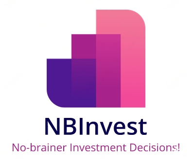

# No-Brainer Investment
 
[![License][license-shield]][license-url]

<!-- PROJECT LOGO -->
 

  
  <h3 align="center">Project No-Brainer Investment (NBInvest)</h3>
  

    UPenn MCIT 59x Hackathon 2023
  

<!-- TABLE OF CONTENTS -->

  
<h2 style="display: inline-block">Table of Contents</h2>

  <ol>
    <li><a href="#about-the-project">About The Project</a></li>
    <li><a href="#dependencies">Dependencies</a></li>
    <li><a href="#license">License</a></li>
    <li><a href="#contact">Contact</a></li>
    <li><a href="#acknowledgements">Acknowledgements</a></li>
    <li><a href="#references">References</a></li>
  </ol>

<!-- ABOUT THE PROJECT -->
## About The Project

#### 🔥This project has won the *Best Technical Implementation Award* at UPenn MCIT 59x Hackathon 2023!

This repository implements NBInvest, an end-to-end mobile App for recommending and making investment decisions.
The repo is primarily developed and maintained by Yiling Zhu, Minyi Hu, and Qi yu.

We employed LSTM model to predict the future week’s stock prices. For each stock, we used 10 years of daily prices and the sequential model imported from [Keras](https://keras.io/). Using this prediction, we are able to help users visualize the predicted stock prices for the next week and let them know if buying at the current time is ideal.
We then seek to perform a risk analysis for the predicted future prices. In particular, we seek to find both the worst- and best-case probability upper bound when the return rate goes below or above a critical threshold determined by characteristic analysis.
To this end, we formulated a sum of squares (SOS) optimization problem, and solved it to global optimality using [PICOS](https://picos-api.gitlab.io/picos/introduction.html).

Click to watch our spotlight video:

## Dependencies

This repo depends on the following packages:
1. keras=2.11.0
2. matplotlib=3.5.1
3. numpy=1.21.5
4. pandas=1.5.2
5. picos=2.4.11
6. python=3.8.13
7. seaborn=0.12.2
8. sumofsquares=1.2.1
9. sympy=1.11.1
10. tensorflow=2.11.0
11. yfinance=0.2.4
12. flutter=2.18.6
13. gradle=7.4

## License

Distributed under the BSD 3-Clause License. See `LICENSE` for more information.

## Contact

- Yiling Zhu - yiling10@seas.upenn.edu
- Minyi Hu - huminyi@seas.upenn.edu
- Qi Yu - yuqij@seas.upenn.edu

## Acknowledgements

We thank the UPenn 59x Hackathon team for organizing this exciting event!

## References
### Frontend
* [Dart](https://dart.dev/): A programming language designed for client development.
* [Flutter](https://flutter.dev/): An open-source UI software development kit.

### Stock price prediction
* [Keras](https://keras.io/): A Python interface for artificial neural networks.
* [TensorFlow](https://www.tensorflow.org/): An open-source software library for machine learning.
* [yfinance](https://pypi.org/project/yfinance/): Tool for downloading market data.

### Risk analysis
* [PICOS](https://picos-api.gitlab.io/picos/introduction.html): A user friendly Python API to conic and integer programming solvers.
* [Sum of Squares programming](https://sums-of-squares.github.io/sos/): Tutorial and examples of sum of squares programming.
* [ORF523](https://aaa.princeton.edu/orf523): Convex and Conic Optimization, Princeton University.

<!-- MARKDOWN LINKS & IMAGES -->
<!-- https://www.markdownguide.org/basic-syntax/#reference-style-links -->
[stars-shield]: https://img.shields.io/github/stars/SafeRoboticsLab/repo.svg?style=for-the-badge
[issues-shield]: https://img.shields.io/github/issues/SafeRoboticsLab/repo.svg?style=for-the-badge
[license-shield]: https://img.shields.io/badge/License-BSD%203--Clause-blue.svg
[license-url]: https://opensource.org/licenses/BSD-3-Clause
[homepage-shield]: https://img.shields.io/badge/-Colab%20Notebook-orange
[homepage-url]: https://github.com/10zhu/nb_invest
